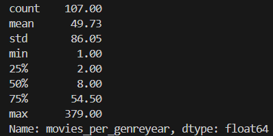
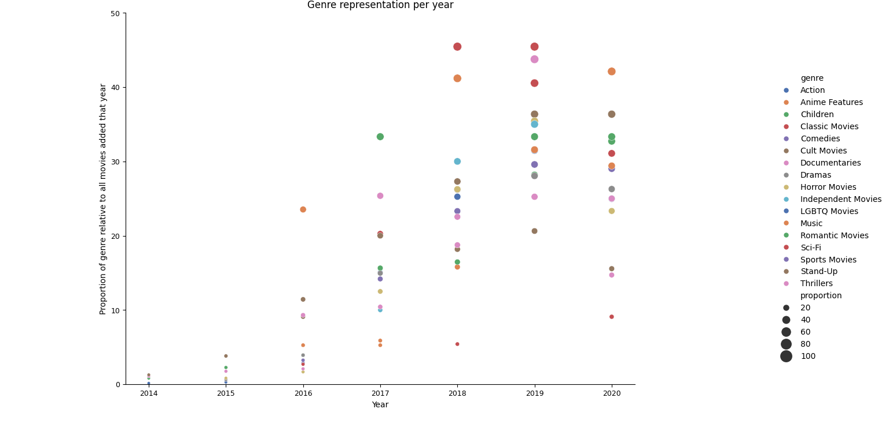
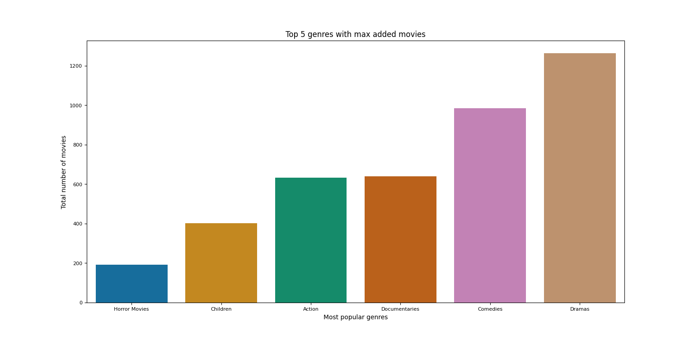

# Data Analysis: the Netflix database

This is an analysis of a Netflix database exploring movie trends in time and including a specific analysis of data subsets aimed at answering various questions about, e.g. trends in movies genre, origin, duration and more.

This analysis started as an assignment in DataCamp meant as practice of data exploration. Originally, the main question was 'Are movies getting shorter?'.
The aim of this project is to explore possible trends in the platform movie db and produce hypotheses regarding the variables involved. A separate but complementary project will deal with the testing of some of them.
## Dataset
The [dataset](data/netflix_data.csv) was downloaded from [kaggle](https://www.kaggle.com/datasets/shivamb/netflix-shows) and consists of +7500 media included in Netflix's catalog up until 2021. Each observation conssists of values for the media's genre, title, description, cast, director, duration, etc.
To the original question, I've added the following.
1. Focusing on movie duration
- Would it be justified to correlate movie duration and year of release? 
- Is genre correlated to duration?
2. Focusing on genre
- Which genres got the most movies added in different years?
- Has Netflix been expanding the range of genres for movies in their library?
3. Focusing on countries and continents
- Which countries have the most released movies in different years? And which ones have the least?
- What can be said about the greater and smaller number of releases per continent?
- How are the different continents represented as proportions of the total movies released each year?
4. 'Historical' analysis
- How are the different genres distributed in time?
- Which genres have gained relevance or lost it?
- Has the distribution of movies changed in relation to continent and countries diversity?

Below are the insights derived from observing possible relations between relevant features of the dataset and the tools and methods I used to that aim.

## 1. Movie duration
### Are movies getting shorter? 
#### Exploring the dataset
After importing the encessary libraries and packages, I loaded the dataset and stored it into a properly named df.

```python
import numpy as np
import matplotlib.pyplot as plt
import pandas as pd
import seaborn as sns

#Load netflix_data.csv as a DataFrame
netflix_df = pd.read_csv(r'pathway\netflix_data.csv')
```
A quick look over the shape, basic info and first row of the df show +7 rows including info on genre, duration, release_year, cast and rating among the ten variables displayed as columns.


To get an idea of how much cleaning is needed, I contrasted the length of the df with the counts for rows with NaN values, counted unique values for the variables and determined how to approach the cleaning. <br /> The complete analysis and validation of data types is [here](code/NaN_movies.py).<br />
Subset the df to only include those variables of interest. Plot the data to look for possible outliers.

<p align="center">

</p>

Here the analysis splits into ((NUMBER)) files corresponding with the main questions:<br />
a. [distribution per duration](code/duration_years.py)<br /> 
b. [distribution per release_year](code/movies_release.py)<br />
c. [distribution per country and continent](code/movies_distrib_country.py)<br />
d. [distribution per genre](code/movies_distrib_genre.py)

To assess questions in 1/a, the df was subset by title, genre, release_year and duration. The movies under 60 minutes and over 180, together with the those marked as 'uncategorized' for genre, were filtered out. This dataset was initially visualized as two different scatterplots to get an idea of the distribution of movies duration in general and movies duration by genre.<br />

<p align="center">

</p>

<p align="center">

</p>

To get a clearer idea of the distribution, the mean for the dataset was plotted using seaborn and specifing the hue argument for 'genre'.
<p align="center">

</p>

While there seems to be a tendency of movies on Netflix to be shorter in time, only a proper statistical analysis taking into account all relevant variables could yield a meaninful answer to the question whether movies overall have been getting shorter. As rergards the question about possible correlations between genres and duration of the movie, the barplot showing mean duration of the movie per genres shows clear differences between all the genres consider in general and specifically between, for example, action movies or dramas, and documentaries or children's movies.

## 2. Movie genre
Moving on with genres in particular, the first cleaning and filtering provides a proper dataset to start analysing the distribution and possible correlations between movie genre and other variables. In this case, apart from the 'uncategorized' genre, the 'International Movies' values are also filtered out to avoid vague categories representing only a small proportion of total values. 

<p align="center">

</p>

Among `seaborn.scatterplot` arguments, both `size` and `hue` were specified to represent the number of movies released each year per genre but the `legend` was set to `False` to avoid cluttering the overview of the data.

To analyse the popular genres, i.e. to answer the two main questions for genre distribution, I filtered out genres with fewer than 8 movies, i.e. the value for the 2Q as shown with `.describe()`.
<p align="center">

</p>

To get an idea of the trends for the different genres by year of release, a barplot provides a good overview esp. with `hue` argument specified for genre. Grouping the filtered df by genre and adding a column with the total sum of movies of each genre every year and then filtering for the max values provide a way to plot the popular genres per year.

<p align="center">

</p>

To see how different genres are represented within Netflix's catalog, subset relevant columns, add a proportion column and plot with hue and size representing genres and proportions respectively. Given the low numbers for years earlier than 2014 and after 2020, those values can be filtered out so proportions are clearer.

<p align="center">

</p>

When comparing the last two plots it's evident that while some genres didn't get as many movies added on specific years, they might represent a large proportion of additions for that year, as is the case of thrillers in 2019 or classic movies in 2019-2020. This provides a 'yes' answer to the question whether Netflix has been expanding genres. 
However, as expected, only certain genres become better represented in different years and the genres accumulating additions in the last years remain the same in the past years. This can be better appreciated by plotting the total count of movies added for genres with the max number of movies added per year. Overall, only five genres represent the max number of movies added since 2014.

<p align="center">

</p>

After checking the distribution of means with `describe()`, the df can be filtered for genres with avgs between 2Q and 3Q values, e.g. 25. A faceted barplot with year for columns shows the influx of movies from different genres each year, displaying a more balanced distribution in the last years.

<p align="center">

</p>

## 3. Countries and continents
In order to get more detailed observations and explore global tendencies in geographical representation in movies added to Netflix's library, all countries were grouped by continent. Since this grouping is not included in the database the [AWOC](https://pypi.org/project/a-world-of-countries/) library was included and used to incorporate the info to the df.
Once the data was cleaned and properly filtered,the dataset includes observations on 11 variables but the df to analize subsets them down to a df with only 2 columns: country and year_added.


### Has Netflix been expanding the range of nationalities of movies in their library?

### Are the movies included in Netflix library evenly distributed by nationality?
- Finding the distribution of nationalities for movies included in Netflix library.
- Visualizing the distribution and finding the most and least represented nationalities in Netflix library.
- 
### Are there changes in the distribution of nationalities of SouthA movies in Netflix in time?
- Finding the total number of movies from South American countries included in Netflix library.
- Visualizing the distribution and finding the most and least represented SouthAm countries in Netflix library.


